# OpenUtau Themes

A collection of themes based on popular UI color palettes.  
To use, put the yaml file in your OpenUtau/Themes folder.

## Catppuccin Mocha/Macchiato/Frappé/Latte

[Source](https://catppuccin.com/palette/)

  
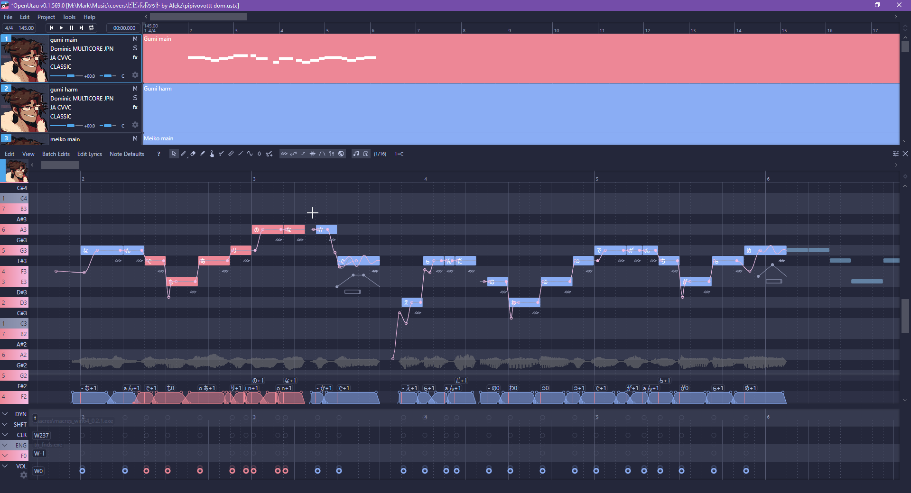  
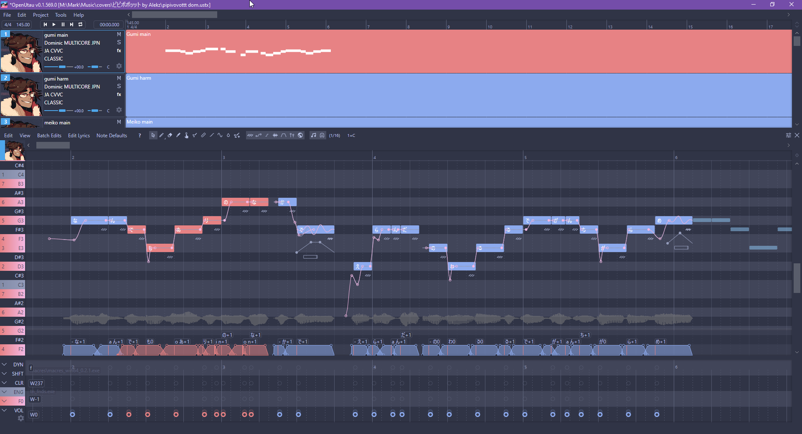  
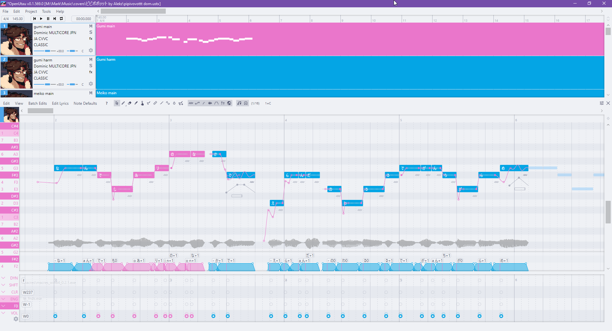

## Dracula/Alucard

[Source](https://draculatheme.com/spec)

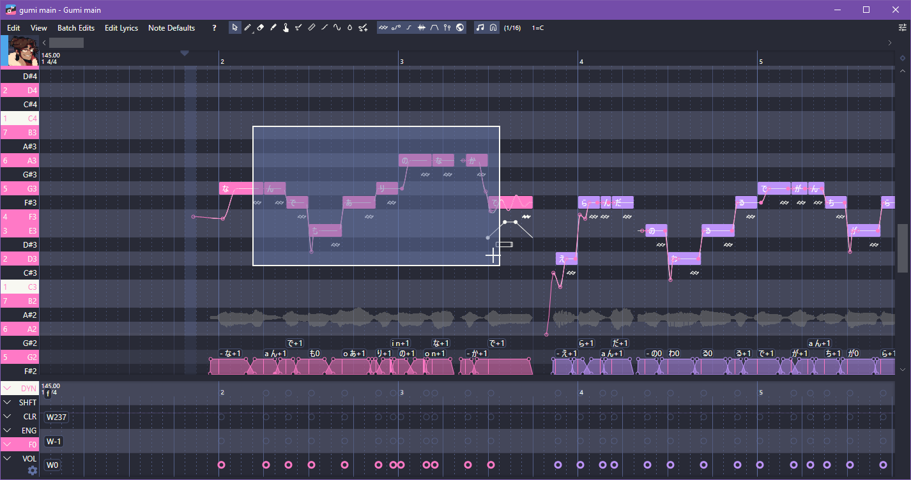  
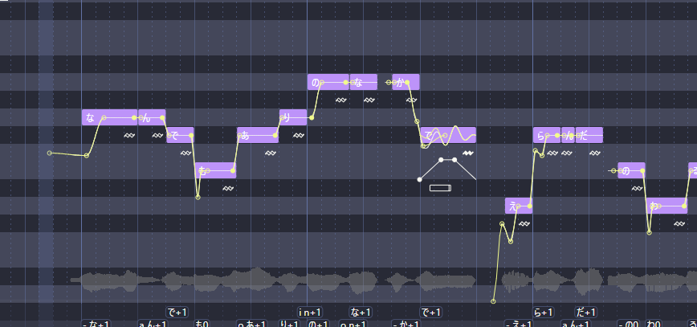

I'm looking for advice on the Alucard theme. Please feel free to make suggestions for which colors to use from the official color palette.

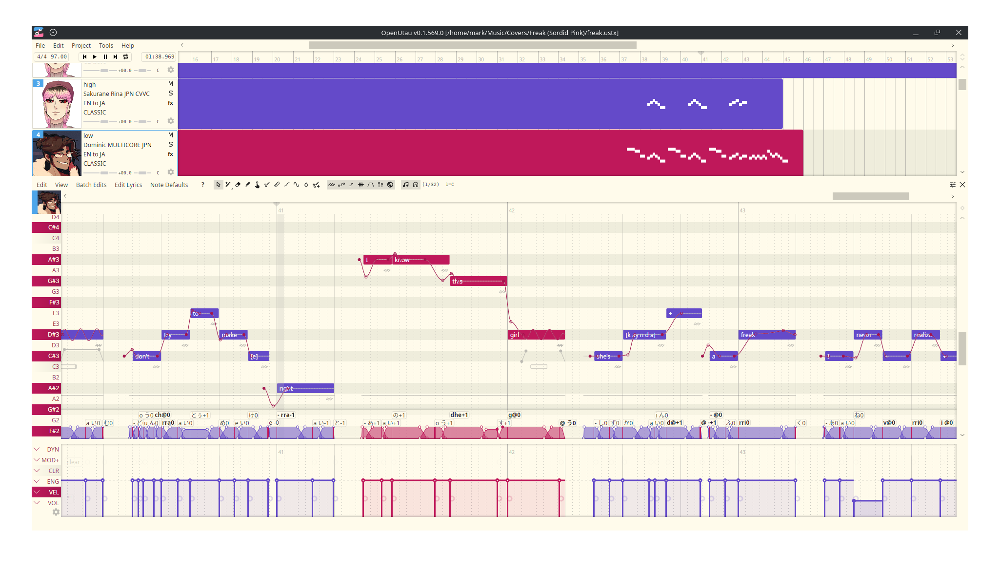

## Gruvbox Dark/Light

[Source](https://github.com/morhetz/gruvbox)

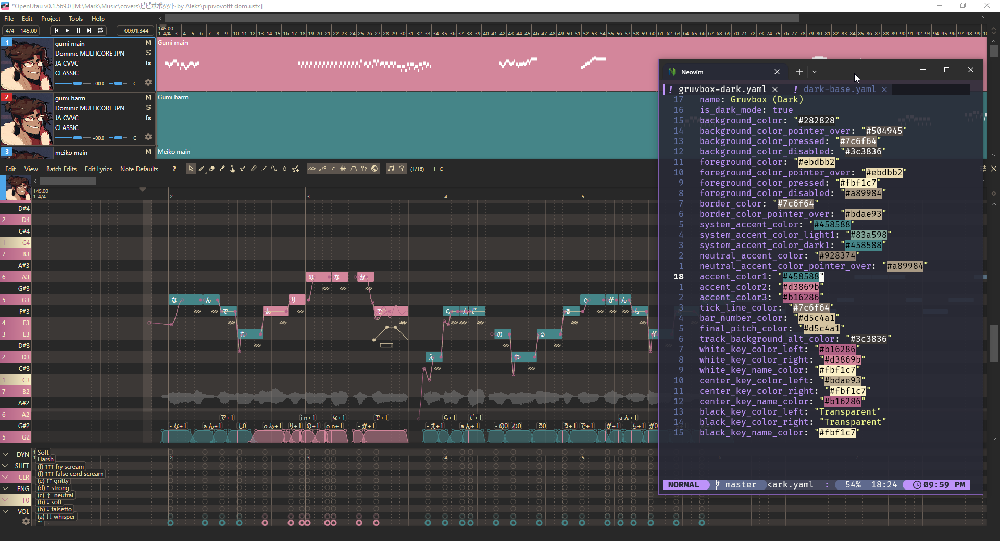  
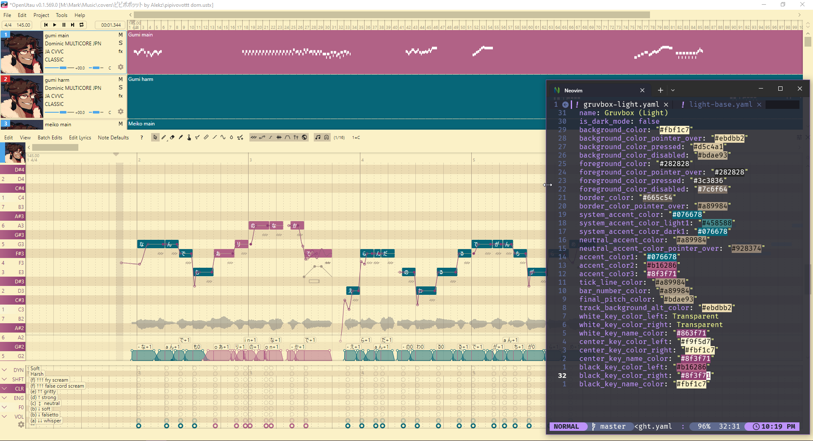

## Monokai

[Source](https://monokai.pro/contribute)

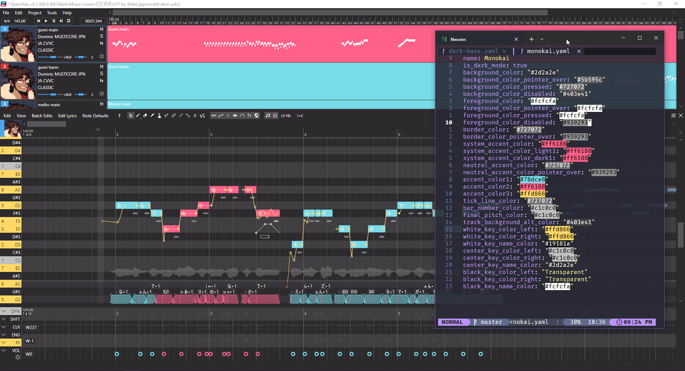

## Nord Dark/Light 

[Source](https://www.nordtheme.com/docs/colors-and-palettes)

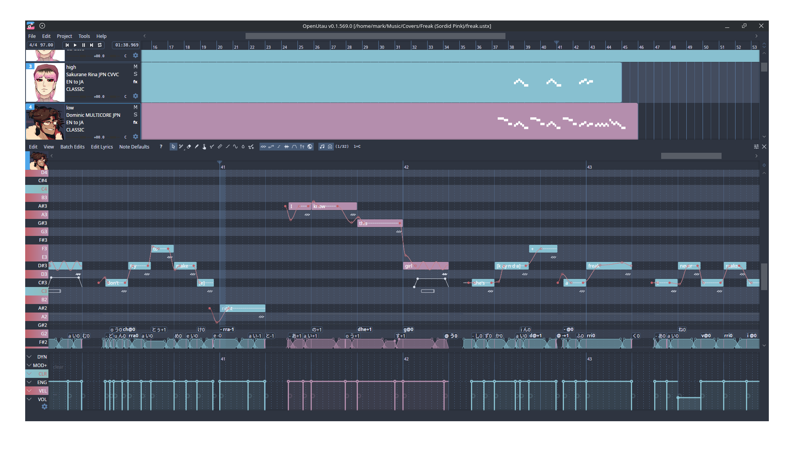  
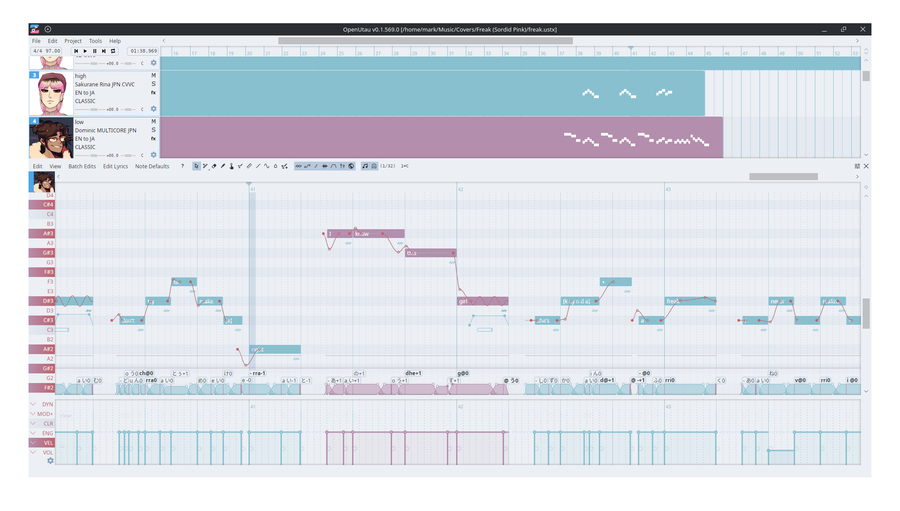

## Solarized Dark/Light

[Source](https://ethanschoonover.com/solarized/)

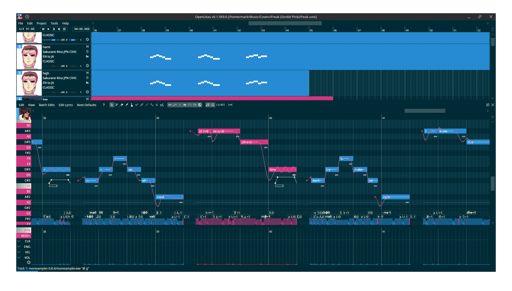  
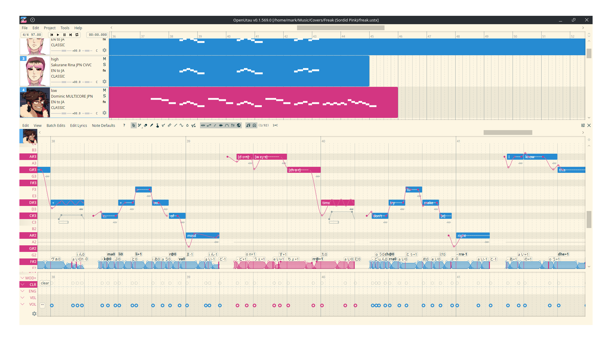

## Planned themes

- Tokyo Night Original/Moon/Storm/Light ([source 1](https://wixdaq.github.io/Tokyo-Night-Website/palette.html)) ([source 2](https://github.com/folke/tokyonight.nvim/tree/main/lua/tokyonight/colors))
- [Everforest Dark/Light](https://github.com/sainnhe/everforest)
- [Rosé Pine Original/Moon/Dawn](https://rosepinetheme.com/palette/)
- Feel free to suggest or contribute any other popular and well-documented color palettes.
